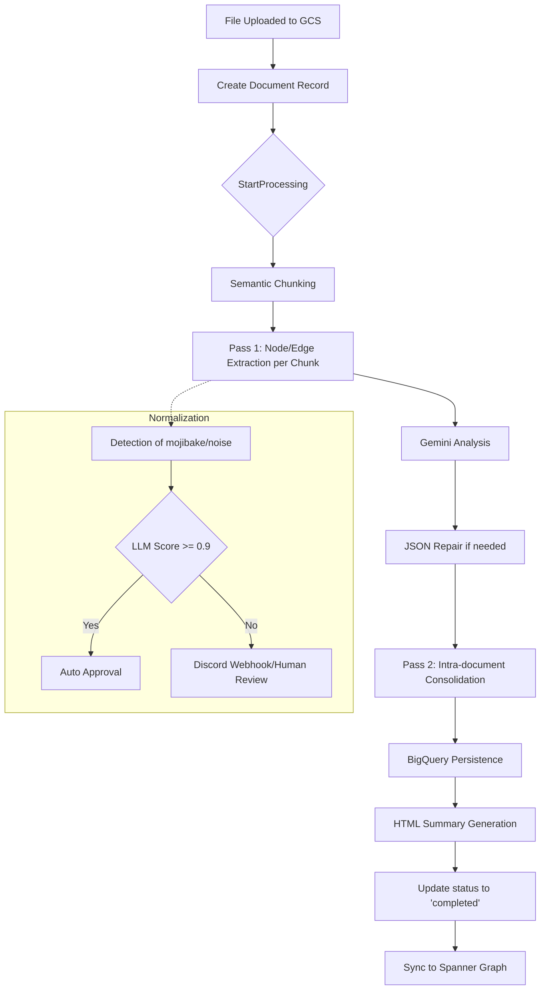

# AI Pipeline Flow

```mermaid
graph TD
    A[File Uploaded to GCS] --> B[Create Document Record]
    B --> C{StartProcessing}
    C --> D[Semantic Chunking]
    D --> E[Pass 1: Node/Edge Extraction per Chunk]
    E --> F[Gemini Analysis]
    F --> G[JSON Repair if needed]
    G --> H[Pass 2: Intra-document Consolidation]
    H --> I[BigQuery Persistence]
    I --> J[HTML Summary Generation]
    J --> K[Update status to 'completed']
    K --> L[Sync to Spanner Graph]

    subgraph "Normalization"
        M[Detection of mojibake/noise] --> N{LLM Score >= 0.9}
        N -- Yes --> O[Auto Approval]
        N -- No --> P[Discord Webhook/Human Review]
    end
    E -.-> M
```
